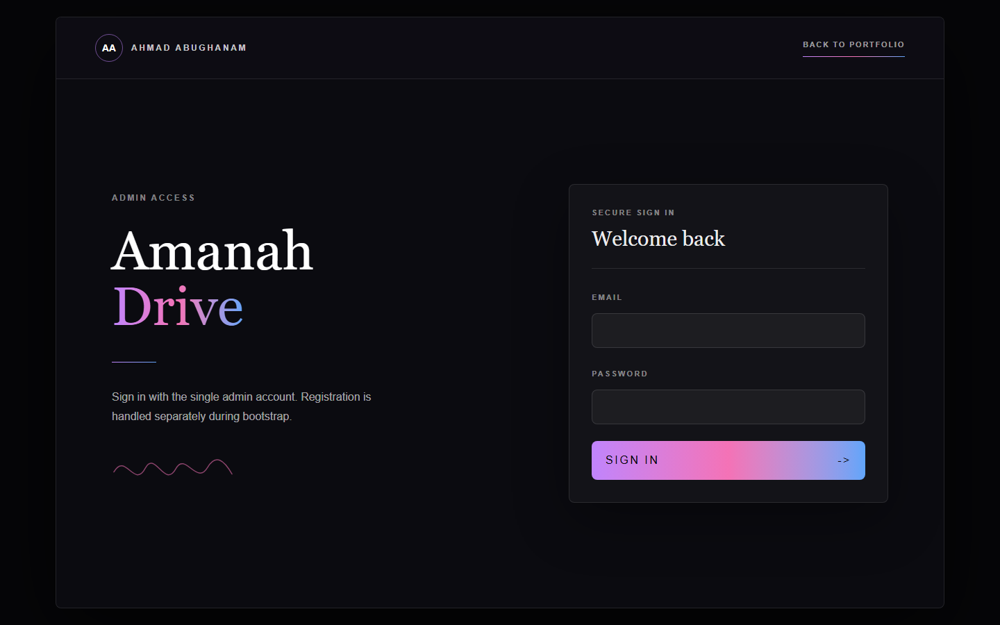
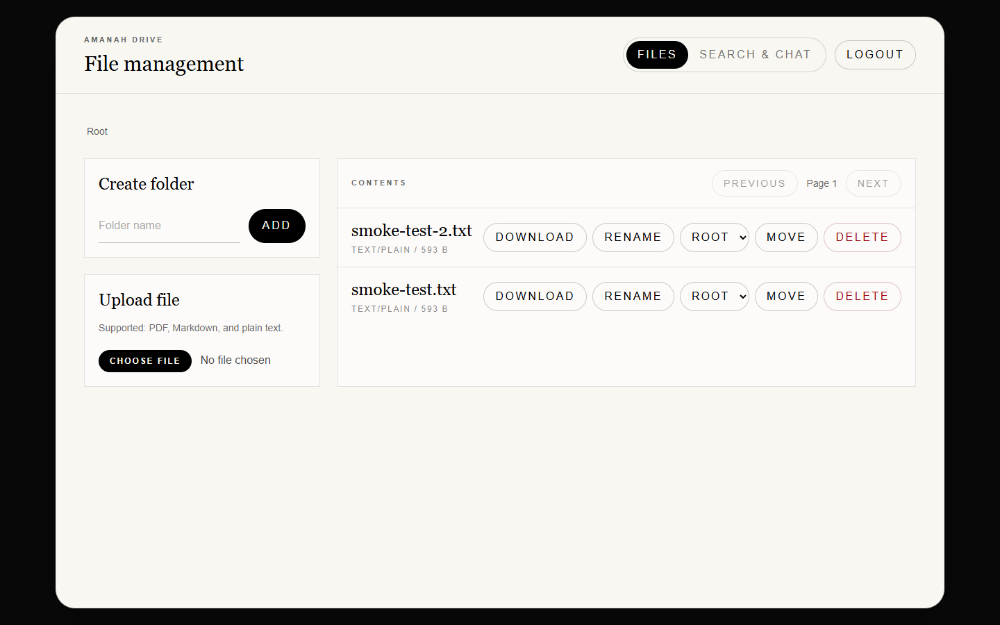
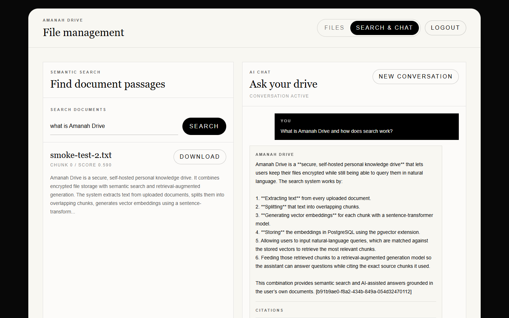
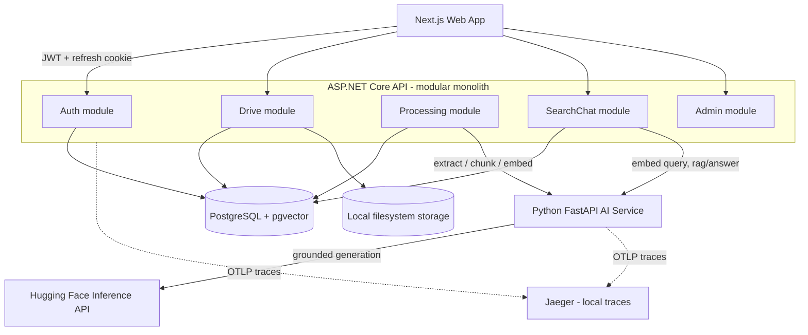
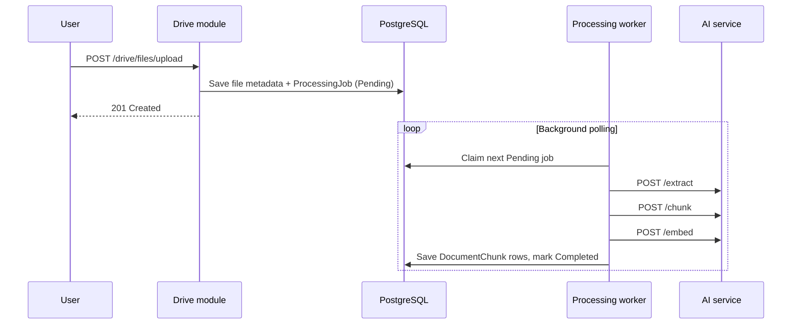
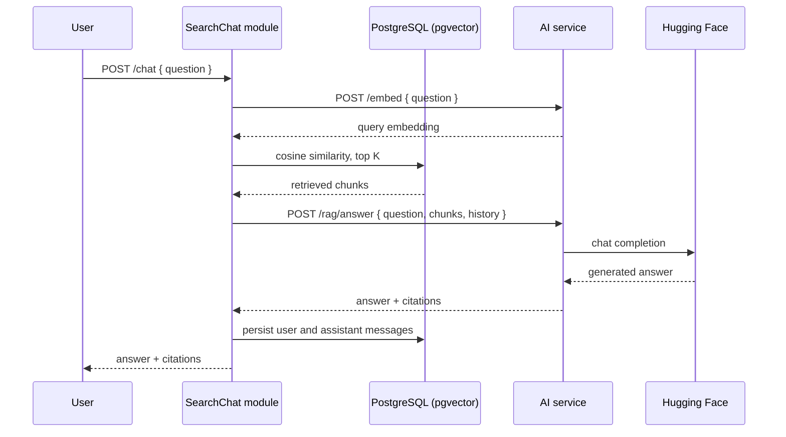

# Amanah Drive

Amanah Drive is a self-hosted personal knowledge drive for one administrator. It combines secure file storage, semantic search, and Retrieval-Augmented Generation (RAG) over uploaded PDF, Markdown, and plain-text documents.

The project is intentionally scoped as a single-admin V1. The backend is structured for maintainability and future extraction, but it remains a single deployable modular monolith until there is a concrete reason to split it.

## Screenshots

| Portfolio landing | Login |
| --- | --- |
|  |  |

| File management | Semantic search and RAG chat |
| --- | --- |
|  |  |

The search and chat screenshot was taken against the implemented embedding and generation pipeline, not a mocked UI.

## Built Scope

- Single-admin authentication with JWT access tokens and refresh-token rotation.
- Folder and file management backed by local filesystem storage.
- Asynchronous document processing: extraction, chunking, embedding, and pgvector storage.
- Semantic search over stored document chunks.
- RAG chat with citations and persisted conversation history.
- Authenticated Next.js dashboard for file management, search, chat, activity, and logs.
- Portfolio landing page and login flow.
- Docker Compose environment for PostgreSQL, API, AI service, and web app.
- CI jobs for API, AI service, and web build/test checks, dependency audits, and CodeQL analysis.
- Interactive OpenAPI documentation for the API at `/docs` when enabled.
- Durable rolling API logs and an authenticated in-app log viewer.
- Non-critical in-process domain notifications projected into an authenticated activity feed.
- Connected API-to-AI-service traces in a local in-memory Jaeger instance.

## Architecture

The ASP.NET Core API is a modular monolith: one deployable service, one PostgreSQL database, and vertical modules for `Auth`, `Drive`, `Processing`, `SearchChat`, and `Admin`. Modules communicate through explicit interfaces rather than direct cross-module data access. The Python FastAPI AI service is a separate stateless service for extraction, chunking, embeddings, and grounded answer generation.

See [Architecture Reference](docs/architecture.md) and [Architecture Decision Records](docs/decisions/README.md) for the detailed boundaries and tradeoffs.

### Document Processing Pipeline

Uploads return after file metadata and a pending job are saved. A background worker claims jobs atomically and performs extraction, chunking, embedding, and vector persistence.

### RAG Chat Flow

Retrieval stays in the API. The AI service receives the already-retrieved chunks and generates a grounded answer with citations.

## Technology Stack

### Web

- Next.js App Router
- React
- TypeScript
- Tailwind CSS
- Playwright tests with mocked API routes

### API

- ASP.NET Core 9
- Minimal APIs
- EF Core and Npgsql
- PostgreSQL with `pgvector`
- JWT bearer authentication
- Serilog structured logging
- Compact-JSON rolling file sink with bounded retention
- Microsoft.AspNetCore.OpenApi document generation
- Scalar interactive API documentation at `/docs`
- OpenTelemetry ASP.NET Core and HTTP client tracing

### AI Service

- Python FastAPI
- pypdf for PDF extraction
- Sentence Transformers with `sentence-transformers/all-MiniLM-L6-v2` embeddings
- Hugging Face Inference API for grounded generation
- OpenTelemetry FastAPI and HTTPX tracing

### Infrastructure

- Docker and Docker Compose
- PostgreSQL named volume
- API log named volume
- Nginx config placeholder
- GitHub Actions CI
- CodeQL analysis for C#, JavaScript/TypeScript, and Python
- Jaeger all-in-one with in-memory local trace storage

## Security

Implemented controls:

- One-time admin bootstrap endpoint protected by `X-Bootstrap-Token`.
- Argon2id password hashing.
- JWT bearer access tokens.
- Refresh-token rotation with reuse detection.
- HttpOnly, Secure, SameSite=Strict refresh cookie.
- Login and bootstrap rate limiting.
- Rate limiting on search and chat.
- Account lockout after repeated failed login attempts.
- Constant-time comparison for bootstrap-token and password-hash checks.
- Explicit CORS allow-list with credentials support; wildcard origins are rejected.
- HSTS outside Development and Testing.
- `X-Content-Type-Options`, `X-Frame-Options`, and Content Security Policy headers.
- MIME allow-list, file size limits, and path traversal protection for uploads and storage.
- Environment-based configuration for secrets and service tokens.

CSRF posture in V1: application mutations require a bearer access token, while refresh/logout use a SameSite=Strict HttpOnly cookie. There is no separate anti-forgery token implementation because the browser-facing write endpoints are not authenticated by cookie alone.

## Engineering Principles

- Modular monolith first; microservices only with a concrete scaling or ownership reason.
- Vertical module ownership for endpoints, services, models, options, and EF configurations.
- Cross-module calls through explicit DI interfaces and DTOs.
- Storage abstraction (`IFileStorage`) so local disk can be replaced later.
- Stateless AI service boundary with no database access.
- Environment-variable based configuration for deploy-time values.
- Structured logging and request logging.
- Background processing with atomic PostgreSQL job claiming.
- Per-phase API, AI service, and web tests.

## Roadmap

### Phase 1 - Foundation

- Repository layout and Docker environment.
- PostgreSQL with pgvector.
- ASP.NET Core API foundation.
- Single-admin auth, refresh-token rotation, login lockout, and bootstrap flow.
- Auth integration tests.

### Phase 2 - Secure Drive

- Folder and file entities.
- Local filesystem storage behind `IFileStorage`.
- Folder CRUD and file upload/download/rename/move/delete endpoints.
- MIME, size, and path traversal checks.
- Drive integration tests.

### Phase 3 - AI Processing

- AI service contract for `/extract`, `/chunk`, and `/embed`.
- FastAPI extraction, chunking, and embedding endpoints.
- Processing jobs and document chunks stored in PostgreSQL with pgvector.
- Background worker for asynchronous document processing.
- API and AI service processing tests.

### Phase 4 - Search and Chat

- API-side pgvector semantic search.
- AI service `/rag/answer` endpoint backed by Hugging Face.
- Chat endpoint with citations.
- Conversation and message persistence.
- Search/chat tests for retrieval, citations, and history.

### Phase 5 - Hardening and Performance

- GitHub Actions CI for API, AI service, and web.
- Rate limiting for expensive search and chat endpoints.
- Configurable CORS and security headers.
- Pagination for folder listing and chat history.
- Static API endpoint reference in [API Reference](docs/api-reference.md).

### Phase 6 - Web Frontend

- Portfolio landing page built from the provided CV.
- Login flow using in-memory access tokens and refresh cookies.
- Authenticated drive shell for folder and file management.
- Landing and login restyling into a shared monochrome design system.

### Phase 7 - Modular Monolith Refactor

- API reorganized into `Modules/Auth`, `Modules/Drive`, `Modules/Processing`, and `Modules/SearchChat`.
- Shared infrastructure moved under `Shared/Infrastructure`.
- SearchChat depends on Processing through `IChunkSearchRepository` instead of direct chunk queries.

### Phase 8 - Embedding Runtime Fix

- Pinned embedding runtime dependencies.
- Added a real-model smoke test path for Sentence Transformers startup.
- Verified real 384-dimension embeddings from the rebuilt AI service container.

### Phase 9 - Search and Chat UI

- Authenticated dashboard tab for semantic search.
- Chat UI with citations and conversation follow-ups.
- Playwright coverage for search results, empty state, chat success, and chat failure.

### Phase 10 - OpenAPI Documentation

- Built-in OpenAPI document generation.
- Scalar UI at `/docs` with JWT bearer authentication support.
- Documentation enabled in Development or through explicit `OpenApi:Enabled` configuration.

### Phase 11 - Health Probes and Job Claiming

- Split health checks into `/health/live` and `/health/ready`.
- Kept `/health` as a readiness alias for compatibility.
- Added PostgreSQL readiness check.
- Reworked job claiming with `FOR UPDATE SKIP LOCKED`.
- Added a real PostgreSQL concurrency test proving jobs are not claimed twice.

### Phase 14 - Durable Logging and Admin Viewer

- Added compact-JSON daily and size-based rolling API logs with bounded retention.
- Persisted API logs in a dedicated Docker named volume.
- Added an authenticated, filtered, paginated admin log endpoint and dashboard view.
- Kept external log aggregation, metrics, and alerting deferred until operational scale requires them.

### Phase 15 - CI Security Scanning

- Added CodeQL analysis for the API, web app, and AI service.
- Added NuGet, npm, and Python dependency vulnerability reports with documented failure policies.
- Updated the vulnerable `pypdf` direct dependency to an available fixed release.

### Phase 16 - Outbound HTTP Resilience

- Added bounded retries with exponential backoff and jitter for API-to-AI-service calls.
- Added per-attempt and total timeouts plus circuit breaking around the API HTTP client.
- Added transient-only Hugging Face retries in the AI service.

### Phase 17 - Local Distributed Tracing

- Added OpenTelemetry tracing to the API and AI service with W3C trace-context propagation.
- Added Jaeger all-in-one to Docker Compose for local, in-memory trace inspection.
- Kept tracing exporters outside startup and readiness dependencies.

## Future Improvements

- Object storage implementation for S3, Cloudflare R2, or MinIO behind `IFileStorage`.
- Multi-user support, roles, and per-user sharing.
- File previews.
- OCR and additional document formats.
- Local LLM support.
- End-to-end encryption.
- Mobile app.
- Real-time synchronization.
- Separately deployable processing worker when background load justifies it.
- Broader observability and scaling work: Prometheus/Grafana, alerting, external trace retention, distributed rate limiting, load testing, and multiple stateless API replicas behind a load balancer.

## References

- [Architecture Reference](docs/architecture.md)
- [API Reference](docs/api-reference.md)
- [AI Service Contract](docs/ai-service-contract.md)
- [Architecture Decision Records](docs/decisions/README.md)
- [Changelog](CHANGELOG.md)
