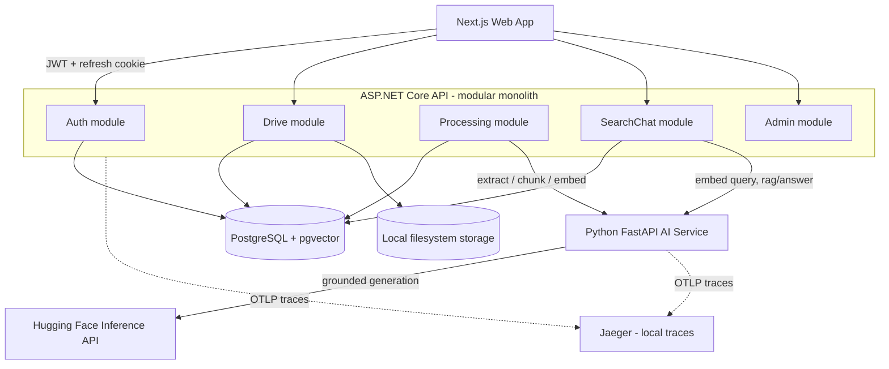
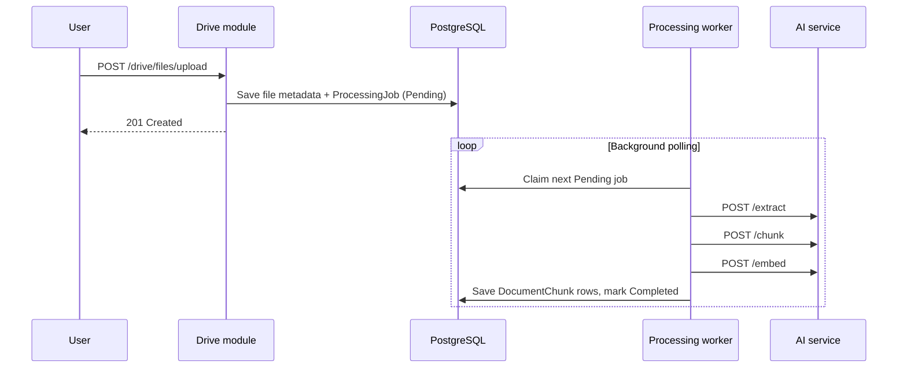
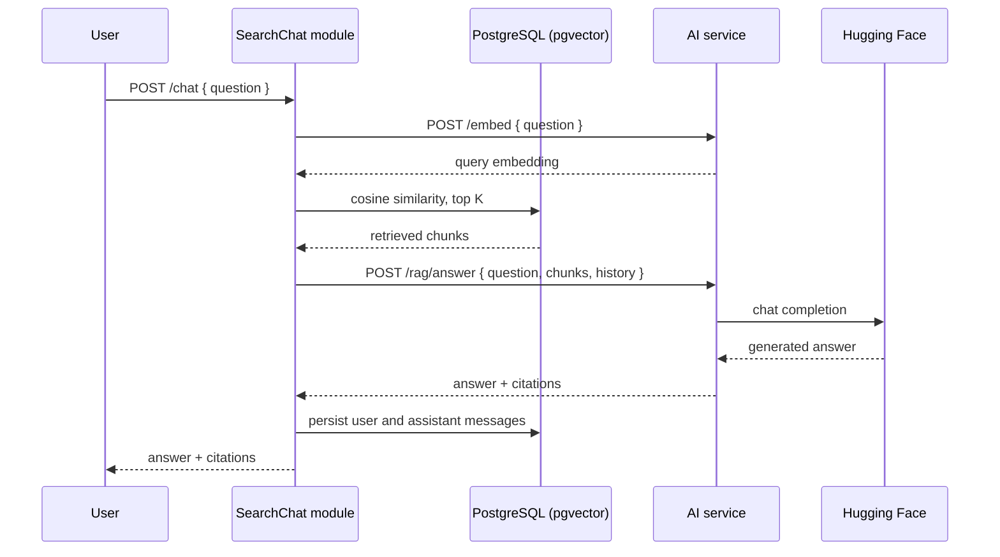

# Architecture Reference

This is the repository architecture reference for Amanah Drive. The README provides the project overview; this document focuses on repository layout, service boundaries, and the architecture diagrams.

## Stack

- Backend API: ASP.NET Core REST API with JWT authentication
- AI service: Python FastAPI with Sentence Transformers for local embeddings and the Hugging Face Inference API for grounded RAG generation
- Web dashboard: Next.js, TypeScript, and Tailwind CSS
- Database: PostgreSQL with `pgvector`
- V1 file storage: local filesystem on the VPS behind a storage abstraction
- Deployment and infrastructure: Docker, Docker Compose, Caddy (reverse proxy with automatic HTTPS), and GitHub Actions — see [Deployment](DEPLOYMENT.md)
- Local distributed tracing: OpenTelemetry exported to an in-memory Jaeger instance

## Diagrams

These are the same diagrams shown in [README.md](../README.md), duplicated here so this reference is self-contained for anyone landing on this file directly.

### System Architecture

### Document Processing Pipeline

Uploads return after file metadata and a pending job are saved. A background worker claims jobs atomically and performs extraction, chunking, embedding, and vector persistence.

### RAG Chat Flow

Retrieval stays in the API. The AI service receives the already-retrieved chunks and generates a grounded answer with citations.

## Repository Layout

* `api/` — ASP.NET Core REST API (authentication, drive behavior, metadata, retrieval, orchestration)
* `ai-service/` — Python FastAPI service (extraction, chunking, embeddings, grounded answer generation)
* `web/` — Next.js portfolio, login, and authenticated dashboard
* `infra/` — Docker Compose, the Caddy reverse-proxy config, and deployment configuration

Each service owns its own dependency manifest and does not reach into another service's directory. New top-level directories should map to one of these four areas; do not introduce a fifth without updating this file.

## Boundaries

- The ASP.NET Core REST API owns authentication, drive behavior, metadata access, retrieval (pgvector similarity search), chat persistence, and orchestration.
- The Python FastAPI AI service owns extraction, embedding generation, and grounded answer generation. It is stateless with respect to business data and has no database access — see [ADR 0002](decisions/0002-stateless-ai-service-boundary.md).
- The Next.js app owns the portfolio landing page, login flow, and authenticated dashboard.
- V1 raw file storage is local filesystem storage on the VPS.
- Metadata, processing jobs, embeddings, chat history, and sessions belong in PostgreSQL and `pgvector`.
- Cloudflare R2, S3, and MinIO are future storage-provider options behind the storage abstraction.

## Module Boundaries (`api/`)

The API is a modular monolith: one deployable ASP.NET Core service, one physical PostgreSQL database, and vertical modules under `api/src/AmanahDrive.Api/Modules`.

- `Modules/Auth` owns admin authentication, tokens, auth endpoints, auth options, and auth entity mappings.
- `Modules/Drive` owns folders, file metadata, drive endpoints, storage abstraction, drive options, and drive entity mappings.
- `Modules/Processing` owns processing jobs, document chunks, the background worker, and chunk retrieval over `pgvector`.
- `Modules/SearchChat` owns search/chat endpoints, conversations, chat messages, and semantic search orchestration.
- `Modules/Admin` owns authenticated operational views, including persisted logs and the activity-feed projection.
- `Shared/DomainEvents` owns the lightweight in-process dispatcher contracts and failure isolation.
- `Shared/Infrastructure` owns cross-cutting infrastructure: DbContext, migrations, external AI HTTP client, CORS, security headers, file-logging configuration, OpenTelemetry tracing, and host-level wiring.

Modules communicate through DI interfaces or plain IDs/DTOs, not direct cross-module data access from feature services. For example, SearchChat asks Processing's `IChunkSearchRepository` for retrieved chunks instead of querying `DocumentChunk` directly.

Module-owned domain-event contracts provide optional in-process notifications for the Admin activity feed. Drive, Processing, and SearchChat publish facts only after their direct business work is committed; Admin handlers project those facts into `activity_entries`. The shared dispatcher isolates handler failures, so activity recording cannot become a prerequisite for upload, processing, or chat behavior. These notifications do not replace direct module calls or provide durable cross-process delivery.

Future split candidates are Auth/User, Drive/File metadata, Processing worker, Search/Chat, AI service, and Web frontend. That split is not happening now; revisit it only with a concrete reason such as independent scaling, deployment ownership, heavy processing load, or separate data ownership.

See [Architecture Decision Records](decisions/README.md) for the reasoning behind these boundaries and other significant decisions.

## Local Tracing

Docker Compose starts Jaeger all-in-one with in-memory trace storage. Open <http://localhost:16686>, select `amanah-drive-api` or `amanah-drive-ai-service`, and search for traces. Requests crossing from the API to the AI service use W3C `traceparent` propagation and appear under one trace ID.

Tracing is not a readiness dependency. Set `OTEL_TRACING_ENABLED=false` to disable export; if Jaeger is unavailable, the API and AI service continue serving requests while their background exporters report and discard failed exports.

Keep this file focused on layout and boundaries. Larger tradeoffs belong in the ADRs.
